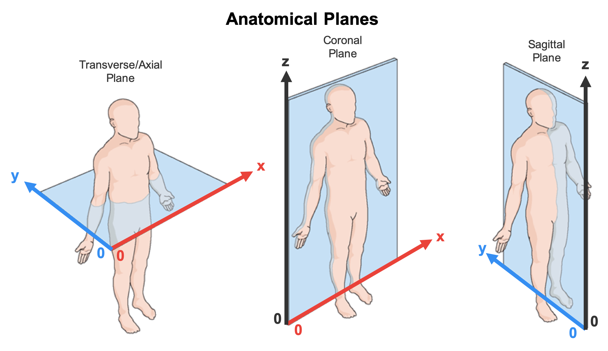

# ALTIS - Automatic Lungs and Trachea Image Segmentation

Repository with useful material for the paper: Azael Sousa et al., "**ALTIS: A Fast and Automatic Lung and Trachea CT-Image Segmentation Method**", Medical Physics Journal 2019.

We propose a method called ALTIS that uses only image processing operators based on optimum connectivity to segment the volume of air of both lungs and trachea separately in CT images of the thorax.

## Materials

ALTIS has been evaluated in a large set of CT images gathered from different public datasets. For each dataset, the gold-standard used in the experiments is provided in the `nii.gz` format.

- *VIA/ELCAP*, the data can be downloaded [here](http://www.via.cornell.edu/lungdb.html). The gold-standard is located at `Materials/via_elcap.zip` in this repository.
- *EXACT09*, the data can be downloaded [here](http://image.diku.dk/exact/). The gold-standard is located at `Materials/exact09.zip` in this repository.
- *LOLA11*, the data can be downloaded [here](https://lola11.grand-challenge.org/). To download the images, one must first register in the competition. The gold-standard is located at `Materials/lola11.zip` in this repository.
- *LIDC IDRI*, the data can be downloaded [here](https://wiki.cancerimagingarchive.net/display/Public/LIDC-IDRI). The gold-standard is located at `Materials/lidc_idri_part1.zip` and `Materials/lidc_idri_part2.zip` in this repository. The data has been separated into 2 parts because its size exceeded 100MB.

## Dependencies

Before running ALTIS, one must install its dependencies. ALTIS requires the shared libraries libatlas, liblapack and libblas. For that, just run the following command on the terminal:

```
sudo apt-get install libatlas-base-dev
```

## Implementation

The implementation of ALTIS is located at the folder `bin/` of this repository. It is the 64-bit binary version for Ubuntu 16.04. In order to run the software, just run the following commands.

```
$cd <path_to_ALTIS_binary>
$chmod +x iftALTIS
$./iftALTIS -i <input_ct_image> -o <output_label_mask>
```

The file formats accepted by the software are: `.nii`, `.nii.gz`, `.hdr`, `.scn`. If some parts of the lungs are left unsegmented, add the flag `--improve-segmentation 25` as shown bellow. It will perform an extra delineation step to try to solve this problem. To see the all available flags of this software, just add the flag `-h` or `--help`.

```
$./iftALTIS -i <input_ct_image> -o <output_label_mask> --improve-segmentation 25
```

---

### Extra Requirements:
- The input image must be **isotropic**: the voxel size is the same in every dimension.
- The considered *patient orientation* in the CT scan must be (see image below):
    - from inferior to superior along the axial slices (z-axis);
    - from right to left along the sagittal slices (x-axis); and
    - from anterior to posterior along the coronal slices (y-axis).




Therefore, in a coronal slice, the lungs and trachea appear in the upright position, being the right lung on the left side of the slice. Otherwise, the method may not run correctly.

If a NIfTI image (`.nii`, `.nii.gz`) is provided, the program automatically rotates it according to the considered anatomical directions.

## Docker

If prefered, there is a docker image with ALTIS and all basic dependencies already installed available at DockerHub under the repository lidsunicamp/altis_docker (https://hub.docker.com/r/lidsunicamp/altis_docker). Inside the image container, one can call the ALTIS program at any folder using the command line:

```
$iftALTIS -i <input_ct_image> -o <output_label_mask>
```

## Contact

If you have any questions or suggestions, please send us a message on the e-mail azaelmsousa@lids.ic.unicamp.br or azaelmsousa@gmail.com.
